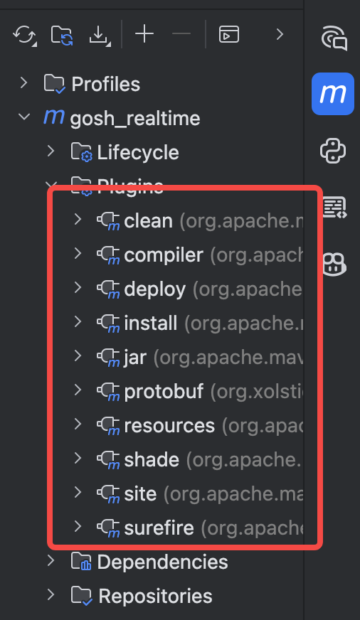
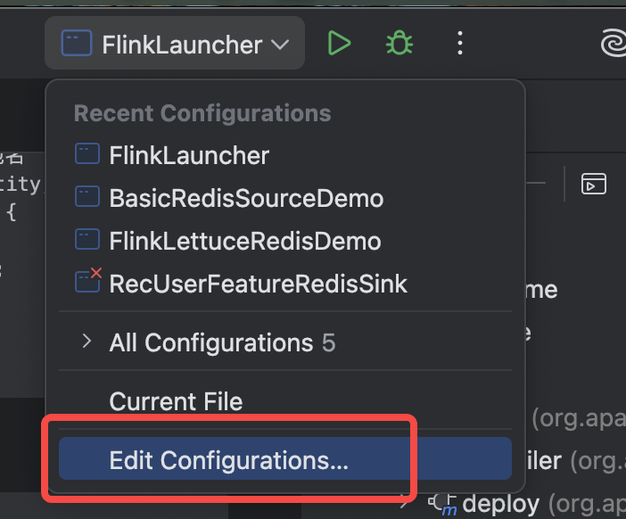
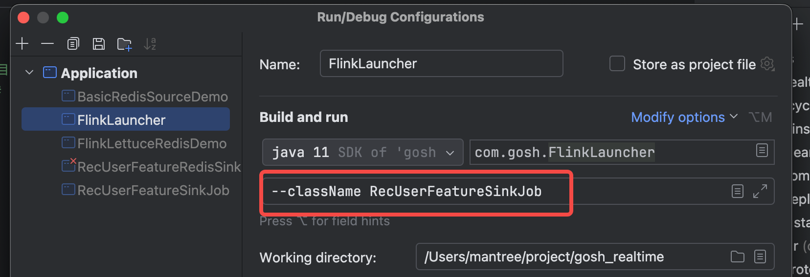
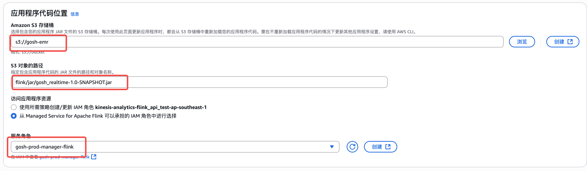
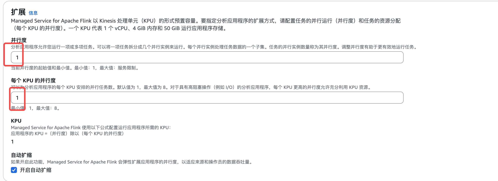
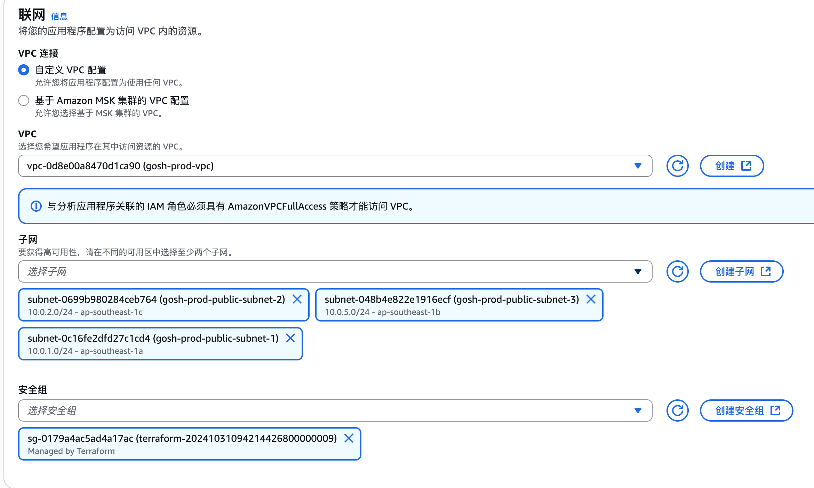
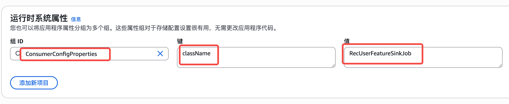

# 开发环境搭建
## 一、JDK 11 安装
```
mac 环境下：
brew install openjdk@11
```
## 二、Maven 3.8.6 安装
```
mac 环境下：
brew install maven@3.8
```

## 三、IDEA 2021.3.3 安装
``` 
mac 环境下：
https://www.jetbrains.com/idea/download/?section=mac
```

## 四、Git 安装
```
mac 环境下：
brew install git    
```

## 五、项目导入
```
1、打开IDEA，选择Import Project，选择项目根目录下的pom.xml文件
2、选择Maven作[.idea](../gosh_redis_connector/.idea)为项目导入方式，点击Next
3、选择项目的JDK版本为11，点击Next
4、点击Finish，等待IDEA导入项目并下载依赖
```


## 六、Protobuf 3.20.0 安装
tips:protobuf编译的话，需要通过appStore安装xcode
### 1、Protobuf 使用说明
1、安装protobuf编译器
```
# 克隆 Protobuf 仓库
git clone https://github.com/protocolbuffers/protobuf.git
cd protobuf

# 切换到 3.20.0 版本标签
git checkout v3.20.0

# 初始化子模块（必需，否则编译失败）
git submodule update --init --recursive

# 配置编译选项
./autogen.sh
./configure --prefix=/usr/local  # 安装到 /usr/local 目录

# 编译并安装（-j4 表示使用 4 线程加速编译）
make -j4
sudo make install
```
2、生成proto文件
```
syntax = "proto3";
#期望生成的java类所在包名
package com.gosh.entity;
message UserMessage {
    int32 id = 1;
    string name = 2;
    int32 age = 3;
}

```

3、生成代码
``` 
cd /Users/xxx/project/gosh_realtime/src/main/java # cd到项目java目录
protoc --java_out=./ ./com/gosh/entity/userMessage.proto # 生成java代码
```

### 2、实现相关代码

### 3、打包处理
```
 $MVN_PATH/bin/mvn clean install -DskipTests

 或者按如下方式打包
```



# 七、项目运行
1、本地运行
   
指定Job类
    
2、AWS flink 运行





3 、ec2 运行测试
```
1、ec2:https://ap-southeast-1.console.aws.amazon.com/ec2-instance-connect/ssh/home?addressFamily=ipv4&connType=standard&instanceId=i-0abb740bbd63c992d&osUser=ubuntu&region=ap-southeast-1&sshPort=22#
2、跳转到项目目录：
    cd /data/temp/gosh_realtime
3、执行git pull 拉取最新代码
    git pull
4、切换至test 分支
    git checkout test
5、执行maven 编译打包命令
    mvn clean compile package
6、执行FlinkLauncher
    java -cp "target/classes:target/lib/*" com.gosh.FlinkLauncher --className RecUserFeatureSinkJob
```
